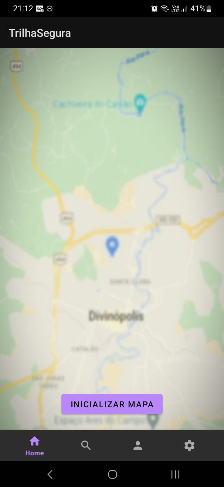
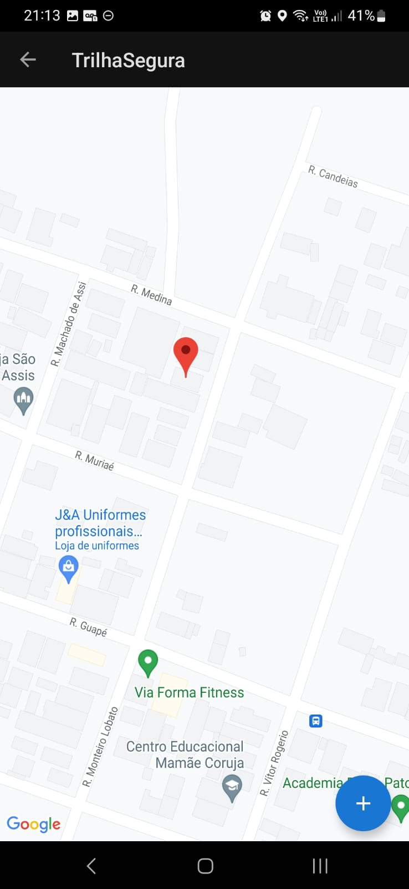
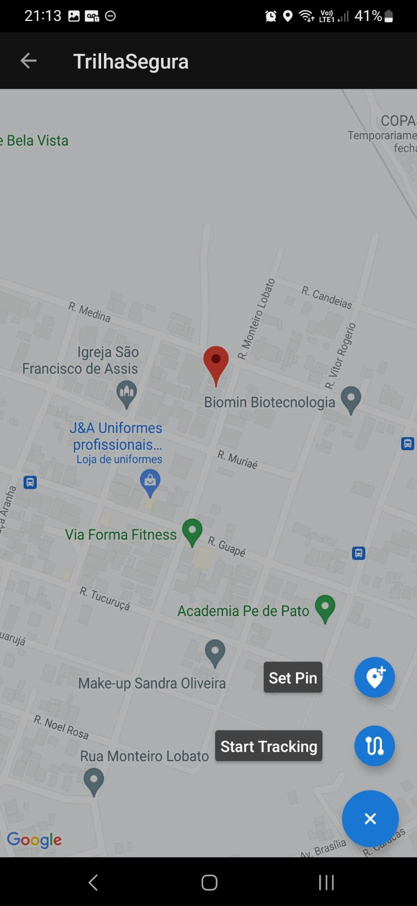
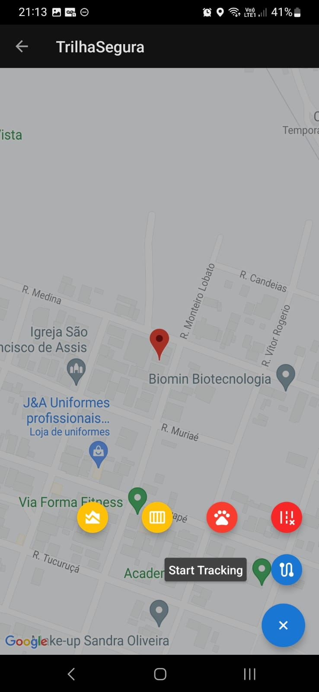
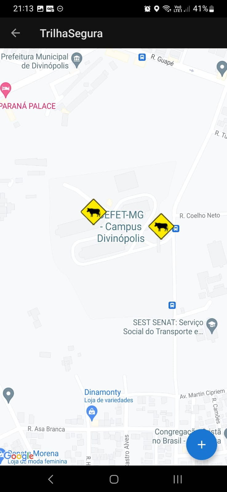
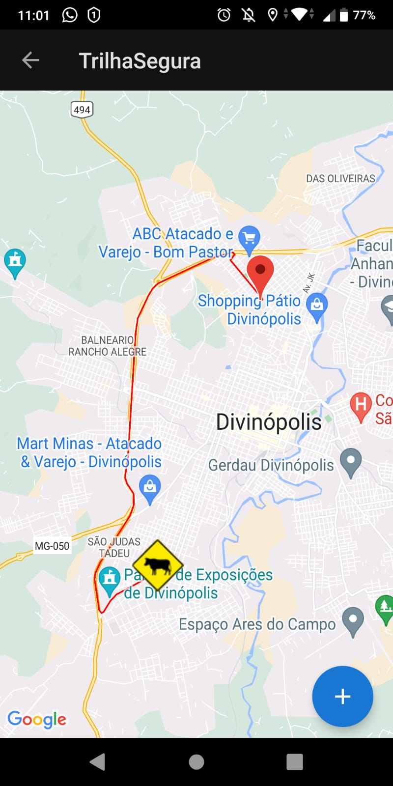
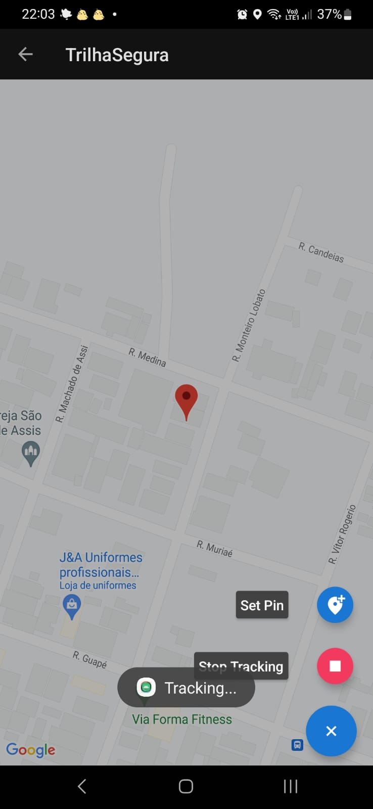

# Trilha Segura

O objetivo final do aplicativo Trilha Segura é proporcionar mais conforto e segurança aos seus usuários, com destaque para seus sistemas de apoio e pins. O sistema de apoio conta com dois alarmes distintos, um para assistência médica e outro para assistência mecânica. Já o sistema de pins tem como propósito oferecer aos usuários uma experiência similar àquela de um motorista ao utilizar o Waze, permitindo que eles decidam a melhor rota a seguir durante seu percurso.

## Participantes do Projeto

Esse projeto foi desenvolvido por alunos de Engenharia de Computação do CEFET-MG como parte da disciplina de Modelagem e Desenvolvimento de Software. A equipe é composta pelos seguintes membros:

* Henrique Souza Fagundes
* João Pedro Martins Espíndola
* Pedro Pinheiro de Siqueira

## Funcionalidade

Devido às limitações de tempo e escopo do projeto, o grupo optou por priorizar o desenvolvimento das funcionalidades de tracking e marcação de pins no aplicativo Trilha Segura. Essas funcionalidades foram selecionadas estrategicamente como elementos-chave para diferenciar o aplicativo de outras soluções existentes. A capacidade de rastrear a localização e marcar pins no mapa proporciona uma experiência única aos usuários, permitindo-lhes explorar e compartilhar informações relevantes sobre trilhas e rotas seguras.

Além disso, foi realizado o processo de integração com um banco de dados, possibilitando que os pins marcados por outros usuários sejam visualizados por qualquer pessoa que utilize o aplicativo.

### Tela Inicial

Ao iniciar o aplicativo Trilha Segura, os usuários são apresentados a uma interface intuitiva e amigável. O layout inclui diferentes botões, cada um com sua funcionalidade específica. Nesta versão inicial do aplicativo, o botão de inicializar o mapa é a única opção implementada e disponível para uso.

  

### Mapa

O mapa reconhecerá automaticamente a localização do usuário, exibindo sua posição atual e destacando os PINs próximos a ele, permitindo que o usuário reconheça o ambiente que está próximo mesmo sem realizar qualquer ação. Isso proporciona uma visão imediata das informações relevantes para a trilha em que está.

  

Além dos PINs já presentes no mapa, os usuários também terão acesso a um botão adicional com o símbolo de '+' localizado no canto inferior direito do mapa. Ao tocar nesse botão, uma nova interação será ativada, permitindo que o usuário marque um novo PIN ou comece a rastrear o caminho que o usuário começará a percorrer.

  

#### Set Pin

Ao clicar no botão "Set Pin", o usuário pode adicionar um marcador (PIN) em uma posição específica do mapa (a que ele está). Isso permite que os usuários marquem locais de interesse ou pontos de referência relevantes para futuras referências. Neste momento existem as seguintes opções de PIN: Pista Escorregadia, Buraco, Mata-Burro e Animal na Trilha. Esses eventos servem para demonstrar a capacidade do aplicativo de sinalizar pontos de interesse e possíveis obstáculos ao longo do caminho, como estes PINs são fáceis de serem adicionados, não havia razão para começar a adicionar uma grande variedade neste nível do aplicativo.

  

  

#### Start Tracking

Ao clicar no botão "Start Tracking", o aplicativo registra o caminho percorrido pelo usuário em tempo real. Isso permite que os usuários gravem suas trilhas, importante para que revisitem-nas posteriormente ou as compartilhem com amigos. Como é possível ver pela imagem, ao iniciar o tracking, um pequeno botão de stop aparecerá no canto direito inferior da tela permitindo que termine de se marcar a rota atual.

  

  

## Tecnologias Utilizadas

O Trilha Segura foi desenvolvido utilizando as seguintes tecnologias e ferramentas:

- Linguagem de Programação Java: Todo o aplicativo foi feito utilizando-se da linguagem Java.
- API do Google Maps: Utilizada para exibir e interagir com os mapas no aplicativo. Para utilizar a API, foi necessário o cadastro de uma chave de API no Console de Desenvolvedor do Google.
- Banco de dados Firebase: Todos os PINs e rotas estão sendo salvas no banco de dados Firebase.
- Android Studio: Ambiente de desenvolvimento integrado (IDE) utilizado para criar o aplicativo Android.

## <s>Instalação e Execução</s> (Instalação e execução do software pausada)

1. Clone este repositório em sua máquina local.

2. Abra o projeto no Android Studio ou em sua IDE de preferência.

3. Compile e execute o aplicativo em um dispositivo Android ou em um emulador.
